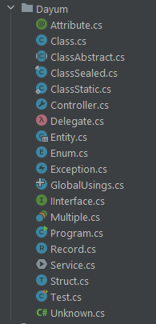

# C# File Type Icons

A JetBrains Rider plugin that shows a different icon for each C# file depending on the type it declares, the same way IntelliJ IDEA does for Java files.

No more rows of identical `.cs` icons: classes, interfaces, enums and more are recognizable at a glance.

## Showcase



> Screenshot taken with the Classic UI plugin.

## What it recognizes

| C# declaration | Icon |
|---|---|
| `class` | Class |
| `abstract class` | Abstract class |
| `interface` | Interface |
| `enum` | Enum |
| `record`, `record struct` | Record |
| `struct` | Type |
| `delegate` | Lambda |
| Exceptions (`*Exception` or derived from one) | Exception (abstract: Abstract exception) |
| Attributes (`*Attribute` or derived from one) | Annotation |
| Controllers (`*Controller`, `Controller`, `ControllerBase`) | Controller |
| `*Dto`, `*Entity`, `*Model` | Model class |
| `*Service` | Services |
| Several top-level types in one file | Multiple type definitions |
| `Program.cs` without types, with `Main` | Entry points |
| `GlobalUsings.cs` (`global using` only) | Include |

Files where no type can be detected keep their default Rider icon.

### Markers

Small overlay markers are added on top of the type icon:

- `static` class
- `sealed` class
- test class (NUnit, MSTest, xUnit)
- class containing `Main`

## Installation

### From disk

1. Download the plugin zip from the [Releases](../../releases) page.
2. In Rider, open **Settings | Plugins**, click the gear icon and choose **Install Plugin from Disk...**.
3. Select the zip and restart the IDE.

### Build from source

```bash
./gradlew buildPlugin
```

The zip appears in `build/distributions`.

To try it in a sandbox IDE:

```bash
./gradlew runIde
```

## How it works

The plugin reads the first part of each `.cs` file, strips comments, strings and preprocessor directives, and detects the declared type with lightweight text analysis, tracking brace depth so nested types are ignored. It does not run a full code analysis, so it stays fast. Results are cached per file and refreshed when the file changes.

## Limitations

- Detection is regex-based, not a real C# parser. Unusual code (raw string literals, heavily nested constructs and similar) may get a generic class icon.
- Only the first 16 KB of each file is inspected.
- Name-based rules (`*Dto`, `*Service`, ...) are heuristics and may not always match your project's conventions.

## License

DoWhatEverYouWant License! :D